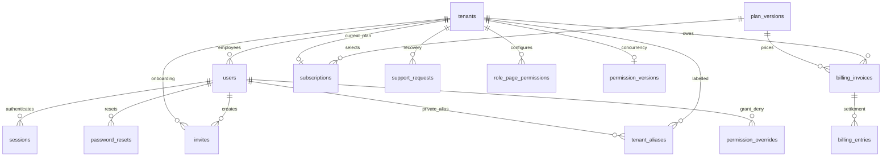
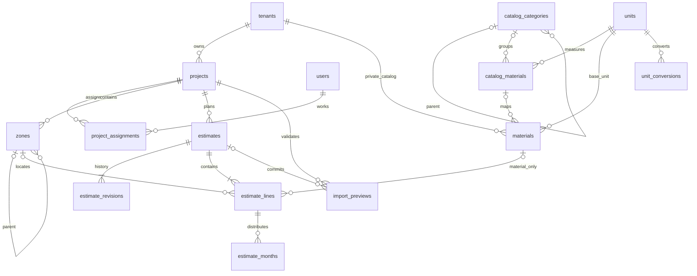
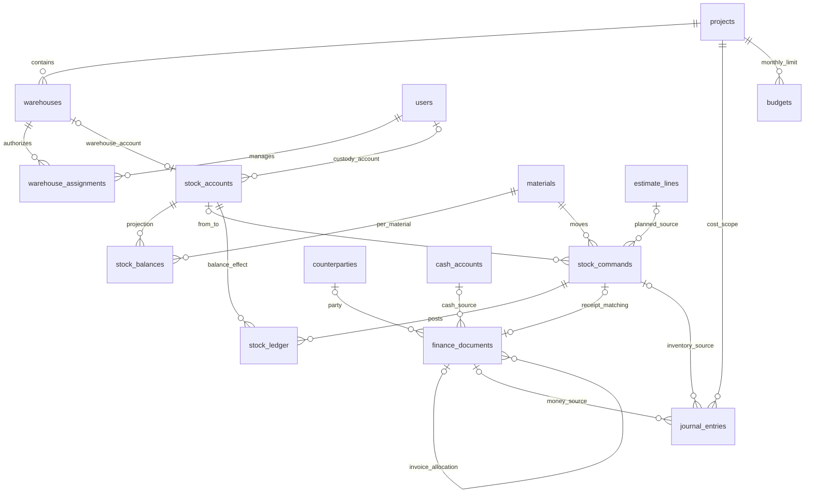
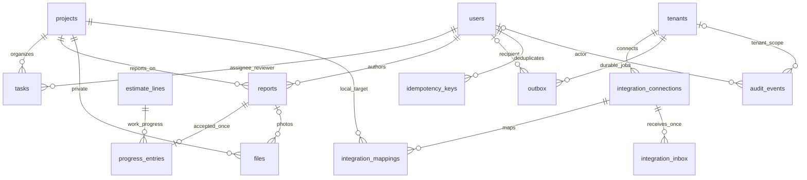

# BARPO AI — Domenlar bo‘yicha ERD

Bu diagrammalar konseptual bog‘lanishlarni ko‘rsatadi; har bir FKning aniq tenant/project composite tarkibi [database spetsifikatsiyasi](BARPO_DATABASE_SPEC.md) dagi executable DDLda berilgan. Cardinality bitta kompaniya/bitta rol modeliga mos.

## Identity va billing

`users.tenant_id` platforma rollarida NULL, tenant rollarida NOT NULL invariantiga ega. `role` bitta scalar. `one_tenant_admin` partial unique indeks bir faol egani ta’minlaydi.

## Obyekt, katalog, smeta

Smeta approvalsiz: revision va import preview — audit/validatsiya. Oldingi estimate_lines fizik o‘chirilmaydi.

## Ombor va moliya

Journal source XOR: finance_document_id yoki stock_command_id, faqat bittasi. Stock source `command_id+material_id+tenant_id` FK bilan bog‘langan. Reversal sourcega unique havola qiladi.

## Ish, fayl, ishonchli yetkazish

Integration inbox va mapping jadvallari tayyor infratuzilma; real provider adapterlari yo‘qligini ERDning mavjudligi o‘zgartirmaydi.
